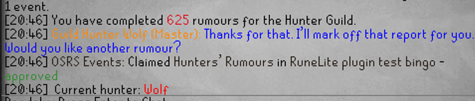

# OSRS Events — RuneLite plugin

Claims bingo squares and Snakes &amp; Ladders tiles on
[osrs-events](https://osrs-events.com) the moment the game shows you got the
drop, killed the boss or finished the run.

> Early development. Not on the Plugin Hub yet.

## What it does

Your event host builds a board. The site tells the plugin which names that
board is waiting for, and nothing else. When one of those names happens in
game, the plugin reports it and the site decides whether it claims anything.

The claim is announced in chat as it lands:



A square that asks for five kills says how far along it is instead of sitting
silent until the fifth:

```
OSRS Events: Zalcano 3 / 5 in Clan bingo night
OSRS Events: Claimed Zalcano in Clan bingo night - approved
```

## What it can claim

| Source | Examples |
|---|---|
| NPC kills and their drops | any monster the loot tracker sees |
| Other loot | clue caskets, chests, raid rewards, Herbiboar |
| Collection log entries | needs the game's own collection log chat setting |
| Kill counts and completions | bosses, Wintertodt, Chambers of Xeric, Barrows |
| Activity counters with their own wording | Hunters' Rumours, Guardians of the Rift, Hallowed Sepulchre per floor, the Grand Hallowed Coffin |

More sources are added as boards ask for them. The matching is by name, so a
square usually starts working the moment the site knows what to watch for —
no plugin update needed.

## What leaves your client

Only what an open square is waiting for. The site sends a watch list; a name
that is not on it is never reported.

A report carries what a host needs to judge a claim without a screenshot:
what died and its combat level, the kill count, everything else that dropped
in the same kill, and the region you were in. Deliberately not included: your
chat, other players' names, and your exact coordinates.

Reporting is off until you turn it on, and it stops the moment you turn it
off.

## Setup

1. Install the plugin.
2. On osrs-events, open **Settings → RuneLite plugin** and create a code.
3. Paste it into **Plugin code** in the plugin settings.
4. Turn on **Send completions**.
5. Tick **Check connection**. The chat says who it connected as, which code it
   used and how many names it is watching.

Chat colours are yours to set: an accent for the names, and separate colours
for an approved and a rejected claim.

## Development

```
./gradlew build
./gradlew run
```

`run` starts a real client in developer mode with the plugin loaded. To log in
with a Jagex Account, follow
[the RuneLite wiki](https://github.com/runelite/runelite/wiki/Using-Jagex-Accounts).
`credentials.properties` logs in without a password: never commit it, and
delete it when you are done.

Point **Server** in the plugin config at a local or staging instance while
testing.

Name normalisation lives in `NameMatcher` and has to match the server's; the
shared cases are in `NameMatcherTest`. The chat wordings the game actually
uses live in `KillCount`, with `KillCountTest` holding the real sentences —
check them against RuneLite's own `ChatCommandsPlugin` before changing them,
not against what sounds plausible.

## Licence

BSD-2-Clause. See [LICENSE](LICENSE).
